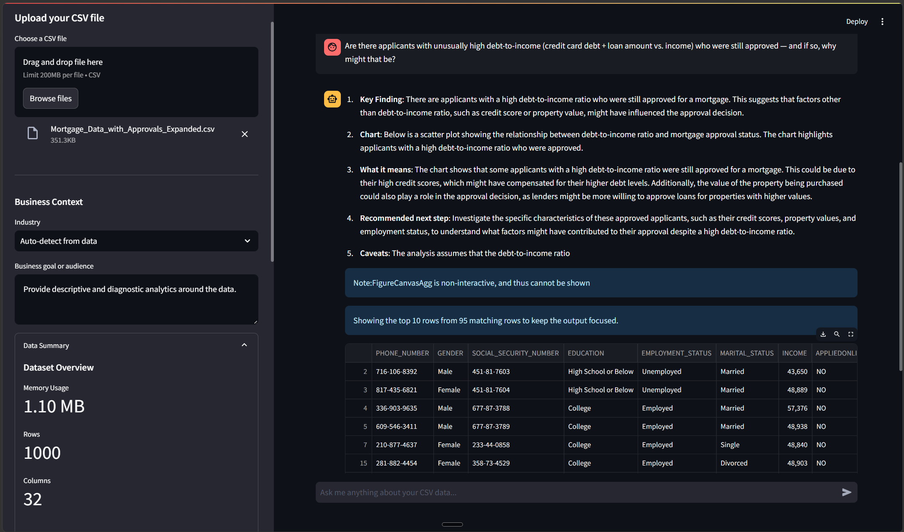
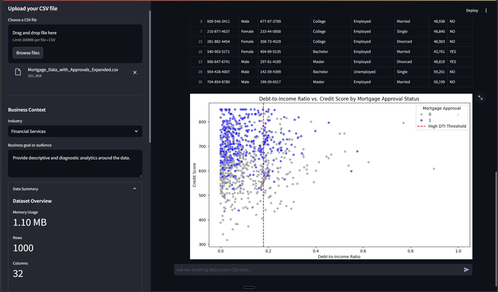

# 📊 AI Data Analytics Assistant | Streamlit + OpenAI

Developed an end-to-end AI-powered analytics solution that transforms raw CSV data into actionable business insights through natural-language interaction. The application leverages OpenAI models to generate stakeholder-ready analyses, dynamic visualizations, filtered datasets, and data quality assessments, making advanced analytics accessible without requiring SQL or Python expertise.


## MVP1 Status

This repository currently represents **MVP1** of the CSV Data Analytics AI Assistant. MVP1 focuses on a single-user Streamlit workflow for uploading one CSV, asking natural-language questions, receiving stakeholder-friendly business insights/results, viewing requested rows/tables, and viewing generated charts without exposing the Python code used behind the scenes.

## What It Does

- Upload a CSV file from the sidebar.
- Preview the first rows of the dataset.
- Review dataset dimensions, memory usage, data quality, and numeric summary statistics in a stacked sidebar layout.
- Add business context, such as industry and audience, to make insights more relevant.
- Ask questions about the data in a chat interface.
- Receive data analysis, result summaries, chart interpretation, business meaning, and recommended next steps in plain language.
- Display requested rows, records, filtered results, and table-style answers as Streamlit dataframes instead of prose-only responses, capped to the requested top/last rows with a maximum of 10 displayed rows.
- Generate charts directly in the Streamlit app without showing the underlying Python code.
- Retain assistant replies, notes, generated tables, and generated chart images in the session chat history.

## Showcase
- [Notion](https://app.notion.com/p/Data-Analysis-Assistant-3bedc859ce3d80b18e49ee2b80b6e99f?v=377dc859ce3d80c094c0000cfa1eba82&source=copy_link)
Add screenshots to `docs/showcase/` and replace the image filenames below with the final files.

| App UI | Graphs And Insights |
| --- | --- |
|  |  |
| The assistant turns a natural-language mortgage-risk question into a stakeholder-ready response. It explains the key finding, why the result matters, recommended next steps, and caveats, while also showing a capped table of matching applicants so the user can inspect examples without being overwhelmed by the full dataset. | The scatter plot compares debt-to-income ratio against credit score by mortgage approval status. From an analysis perspective, it helps identify approved applicants above the high-DTI threshold and suggests that approval decisions may be influenced by compensating factors such as stronger credit scores, property value, or other borrower characteristics. |

## Tech Stack

- [Streamlit](https://streamlit.io/) for the web app
- [pandas](https://pandas.pydata.org/) for data loading and analysis
- [OpenAI Python SDK](https://github.com/openai/openai-python) for AI responses
- [Matplotlib](https://matplotlib.org/) and [Seaborn](https://seaborn.pydata.org/) for visualizations

## Project Structure

```text
.
+-- app.py
+-- sample_data.csv
+-- .streamlit/
|   +-- secrets.toml
+-- .gitignore
+-- README.md
```

`sample_data.csv` contains 60 example e-commerce orders across customer regions, product categories, payment methods, quantities, unit prices, and total order amounts.

## Getting Started

### Prerequisites

- Python 3.10 or newer
- An OpenAI API key
- pip

### Installation

1. Clone the repository:

   ```bash
   git clone <repository-url>
   cd Streamlit-Data-Analytics-AI-Assistant-1
   ```

2. Create and activate a virtual environment:

   ```bash
   python -m venv .venv
   .venv\Scripts\activate
   ```

   On macOS or Linux:

   ```bash
   python -m venv .venv
   source .venv/bin/activate
   ```

3. Install dependencies:

   ```bash
   pip install -r requirements.txt
   ```

4. Add your OpenAI API key to `.streamlit/secrets.toml`:

   ```toml
   OpenAI_API_Key = "your-api-key-here"
   OpenAI_Model = "gpt-4o"
   ```

5. Run the app:

   ```bash
   streamlit run app.py
   ```

6. Open the local Streamlit URL shown in your terminal, usually:

   ```text
   http://localhost:8501
   ```

## Usage

1. Upload a CSV file in the sidebar.
2. Expand **Preview Data** to inspect the first 10 rows.
3. Add optional **Business Context** in the sidebar.
4. Expand **Data Summary** in the sidebar to review dataset overview, data quality, and numeric statistics.
5. Ask questions in the chat box.

Example questions:

- What is the average total amount?
- Which product category has the highest revenue?
- Show sales by customer region.
- Create a bar chart of the top 10 products by total amount.
- What are the null values in each column?
- Show the top 20 records where total amount is above 500.
- What is the correlation between quantity, unit price, and total amount?

## How The App Works

When a CSV is uploaded, `app.py` stores the dataframe and a compact data summary in Streamlit session state. For smaller datasets, the full dataframe is included in the prompt context. For datasets with more than 100 rows, the app sends a summarized context instead to reduce token usage.

The assistant can return hidden Python code blocks for chart and table generation. The app extracts and executes those hidden blocks with access to `df`, `pd`, `np`, `plt`, `sns`, and `st`. For visual requests, it renders and saves generated Matplotlib figures as chat images. For list-style, row, record, or filtered-result requests, it renders pandas DataFrames with `st.dataframe(...)` and stores them in the chat history. Generated tables are capped to the requested top/last rows, with a maximum of 10 rows displayed, so large datasets do not flood the interface. The user-facing chat shows business-oriented analysis, results, notes, tables, and charts, not the Python code.

The prompt includes optional business context from the sidebar so chart explanations can be framed for the relevant industry, audience, and business goal instead of only describing visual patterns.

Assistant text, warning notes, generated tables, and generated chart images are saved in Streamlit session state so they remain visible when the app reruns during the same session.

## Configuration

The OpenAI call is configured in `app.py`:

```python
response = client.chat.completions.create(
    model=OPENAI_MODEL,
    messages=[
        {"role": "system", "content": system_prompt},
        {"role": "user", "content": user_input}
    ],
    temperature=0.1,
    max_tokens=500
)
```

If your OpenAI project does not have access to the configured model, update `OpenAI_Model` in `.streamlit/secrets.toml` to a model available for your project.

## Security Notes

- Do not commit `.streamlit/secrets.toml`.
- Keep your OpenAI API key private.
- Review API usage to avoid unexpected costs.
- Be careful with untrusted prompts or files. The app executes hidden Python code returned by the model for analysis and visualizations, so only run it in an environment where you are comfortable testing generated code.

## Troubleshooting

- **Missing API key**: Confirm `.streamlit/secrets.toml` exists and contains `OpenAI_API_Key`.
- **CSV upload fails**: Check that the file is a valid CSV and uses a readable encoding.
- **OpenAI request fails**: Confirm your API key, model access, billing status, and network connection.
- **Generated chart fails**: Rephrase the question with exact column names from the uploaded CSV.
- **Requested rows or lists do not appear**: Ask for a table, rows, records, or a filtered dataframe and include the relevant column names. The app displays at most 10 rows for generated result tables.
- **Large file responses are vague**: Ask more specific questions or filter the CSV before uploading.

## License

This project is available for personal and educational use.
