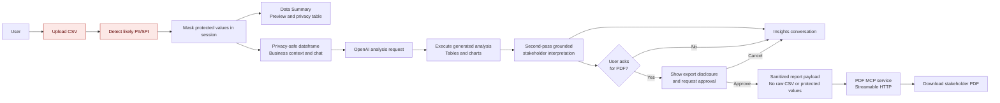
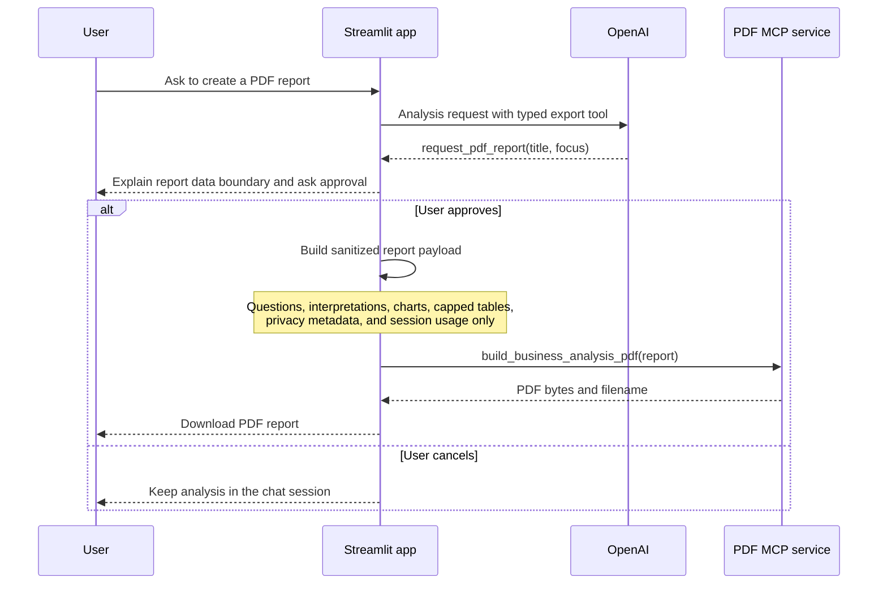

# MVP2 Architecture

This document is the versioned source of truth for the MVP2 workflow. It complements the shared Mermaid workspace linked from the README and should be updated whenever the application boundary or export contract changes.

## Privacy-Safe Analysis And Report Flow

## PDF Export Sequence

## Report Contents

The first page contains a structured report overview, privacy-protection summary, detected PII/SPI column metadata, and session usage. The remaining pages contain business questions, grounded stakeholder interpretations, charts, capped result tables, and caveats. The report records only metadata about protected columns, never original or masked sensitive values.

## Deployment Boundary

The bundled local service runs at `http://localhost:8000/mcp` for development. Production deployment must terminate TLS, expose an authenticated HTTPS `/mcp` endpoint, and set `PDF_MCP_URL` in Streamlit configuration. The Streamable HTTP transport keeps the service deployable without a local stdio dependency.
